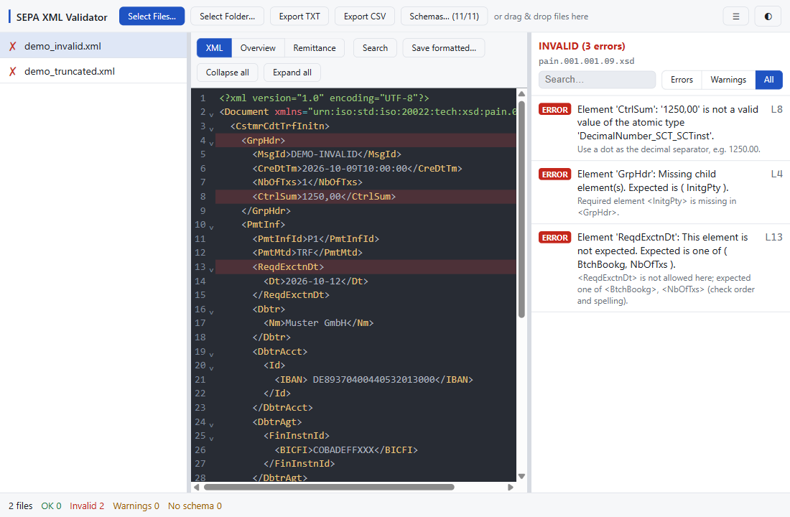

# SEPA-Validator

Validate SEPA payment XML files against ISO 20022 XSD schemas, and catch the mistakes the schema can't see.

   [](https://github.com/lkasdorf/SEPA-Validator/releases/latest) [](https://github.com/lkasdorf/SEPA-Validator/actions/workflows/ci.yml)



This repository contains:

- **SEPA Validator desktop app** (`app/`): a native Windows app (Tauri + Rust + Svelte) with a live, clickable validation log. **This is the recommended tool.**
- **CLI scripts** (`scripts/`): bash validators for Linux, macOS and WSL.

Both validate with **libxml2**. Everything runs locally; no file leaves your machine.

The original PowerShell/WinForms tool was retired in favour of the desktop app. It is still available at tag [`v1.0.0`](https://github.com/lkasdorf/SEPA-Validator/tree/v1.0.0/windows).

---

## Desktop app (recommended)

A native Windows application that validates one or many files at once and lets you drill into exactly where each one fails.

### Features

- **Strict XSD validation.** Files that aren't well-formed fail with a located error. Values are checked exactly as written, so a stray space in an IBAN or an empty `<Nm></Nm>` is caught.
- **Plausibility checks** the schema can't express, reported as warnings:
  - `NbOfTxs` and `CtrlSum` checked against the actual transactions.
  - IBAN check digits (mod 97).
  - Execution or collection dates in the past.
  - Duplicate EndToEndIds.
- **Readable messages with hints.** For example: "Use a dot as the decimal separator, e.g. 1250.00." or "Required element <InitgPty> is missing in <GrpHdr>."
- **Live log, click to the error.** Results stream in as files are validated. Click any error to jump to its line in a syntax-highlighted, pretty-printed XML viewer. Search with `Ctrl+F`, fold blocks, and **Cancel** a long run.
- **Overview and Remittance tabs.** The **Overview** shows the creditor and `PmtInf` statistics for pain.001 and pain.008. **Remittance** lists every transaction with its origin and remittance info, and exports it as CSV.
- **Save formatted…** writes the indented XML as a new file. Values stay byte-identical, and the original is never touched.
- **Schemas… dialog.** Import the XSDs as `.xsd` files, a folder or a `.zip`, and see which are present. Schemas are **not bundled** (see below).
- **Export and convenience.** TXT/CSV export, light/dark theme, drag & drop, a Help/About menu with third-party licenses, and a built-in **auto-updater**.

### Install

1. Download the latest release from the [**Releases**](https://github.com/lkasdorf/SEPA-Validator/releases/latest) page:
   - `SEPA-Validator-<version>-windows-x64-setup.exe` (installer), or
   - `SEPA-Validator-<version>-windows-x64-portable.exe` (single standalone executable, no installation).
2. Run it. It needs the Microsoft **WebView2** runtime, which is preinstalled on current Windows 10/11. The executables are not code-signed, so SmartScreen may warn: choose **More info → Run anyway**.
3. To update, use **☰ → Check for Updates**. The installed app updates itself. The portable version offers the new portable file to download, so it never installs a second copy.

### First run: import the XSD schemas

The schemas are **not distributed** with the app because they are not redistributable.
1. Open **Schemas…**.
2. Download the schemas from the [official sources](#obtaining-xsd-schemas).
3. Import them as `.xsd` files, a folder or a `.zip`.

The badge in the toolbar shows how many of the expected schemas are present.

### Build from source

```sh
cd app
npm install
npx tauri dev                 # run with hot reload
npx tauri build               # build the installer -> app/src-tauri/target/release/bundle/
```

First-time native setup is documented in [`app/README.md`](app/README.md): vcpkg + libxml2, libclang and a local `.cargo/config.toml`. How releases are built and signed is described in [`RELEASING.md`](RELEASING.md).

---

## Supported SEPA formats

Provide the matching XSD via the Schemas… dialog (desktop app) or `xml_schema/` (CLI).

| Format | Description |
|--------|-------------|
| pain.001.001.03 / .09 | Credit transfers (`.09` is current) |
| pain.002.001.10 | Payment status reports |
| pain.007.001.09 | Payment reversals (the app uses the GBIC variant) |
| pain.008.001.02 / .08 | Direct debits (`.08` is current) |
| camt.054.001.08 | Bank-to-customer debit/credit notification |
| container.nnn.001.GBIC4 | DK/GBIC container |

### Swiss Payment Standards (desktop app only)

| Format | Description |
|--------|-------------|
| pain.001.001.09.ch.03 | Swiss credit transfer (SPS 2025/2026) |
| pain.008.001.02.ch.03 | Swiss direct debit (CH-DD / LSV+) |
| pain.008.001.02.chsdd.02 | SEPA direct debit, Swiss variant |

The Swiss pain.008 variants have their own namespaces. The Swiss pain.001 shares the ISO namespace with the standard pain.001.001.09, so the app picks the Swiss schema per file. It does so when:
- the first debtor account (`DbtrAcct` IBAN) is Swiss or Liechtenstein (`CH…`/`LI…`), or
- `xsi:schemaLocation` names a `.ch.` schema.

Creditor accounts don't count: a German payer sending money to a Swiss account is still checked against the standard schema. The result shows which schema was used.

## Obtaining XSD schemas

The XSD schema files are **not included** in this repository. Download them from the official sources:

| Source | Schemas | URL |
|--------|---------|-----|
| ISO 20022 | pain.001, pain.002, pain.008, camt.054, … | [iso20022.org](https://www.iso20022.org/catalogue-of-iso-20022-messages) |
| Deutsche Kreditwirtschaft (DK) | GBIC variants for German SEPA | [die-dk.de](https://die-dk.de/themen/zahlungsverkehr/) |
| EBICS (Germany) | German SEPA data formats & schemas | [ebics.de](https://www.ebics.de/de/datenformate) |
| SIX (Switzerland) | Swiss Payment Standards (`.ch.` schemas) | [six-group.com](https://www.six-group.com/en/products-services/banking-services/payment-standardization/standards/iso-20022.html) |
| EPC | EPC SEPA scheme rulebooks | [europeanpaymentscouncil.eu](https://www.europeanpaymentscouncil.eu/document-library) |

For the **desktop app**, import the downloaded files via the **Schemas…** dialog. For the **CLI**, place the `.xsd` files in `xml_schema/`, or pass `--schema-dir`.

---

## CLI (Linux / macOS / WSL)

Requires `xmllint`: `sudo apt install libxml2-utils`, or `brew install libxml2` on macOS. Validation never touches the network (`xmllint --nonet`).

```bash
# Validate a single file, multiple files, or a whole folder
./scripts/validate.sh payment.xml
./scripts/validate.sh file1.xml file2.xml
./scripts/validate.sh /path/to/xml/files/

# Options
./scripts/validate.sh --schema-dir ./my-schemas payment.xml   # custom schema directory
./scripts/validate.sh --export report.txt *.xml               # text report with every error per file
./scripts/validate.sh --csv report.csv *.xml                  # CSV (RFC 4180), all errors of a file in one cell
./scripts/validate.sh -q *.xml                                # quiet: errors + summary only
```

The batch and data-curation helpers additionally need `rg` ([ripgrep](https://github.com/BurntSushi/ripgrep)):

- `scripts/validate_all.sh` batch-validates a folder tree and writes a CSV report.
- `scripts/rename_xml_by_date_company_format.sh` renames files to `YYYYMMDD_COMPANY_FORMAT.xml`.
- `scripts/rename_xml_by_schema.sh` renames files to `YYYYMMDD_BIC_FORMAT.xml`.

---

## Project structure

```
app/                    # Desktop app: Tauri + Rust + Svelte
  src/                  #   Svelte/TypeScript frontend
  src-tauri/            #   Rust backend (libxml2 validation, plausibility checks, schema import, updater)
scripts/                # Bash CLI validators, renaming helpers, release and notices tooling
docs/                   # Screenshot and design notes
xml_schema/             # Your XSD schema files (not included; download from the sources above)
```

## License

[MIT](LICENSE). Third-party components and their licenses are listed in [`app/THIRD-PARTY-NOTICES.txt`](app/THIRD-PARTY-NOTICES.txt).
